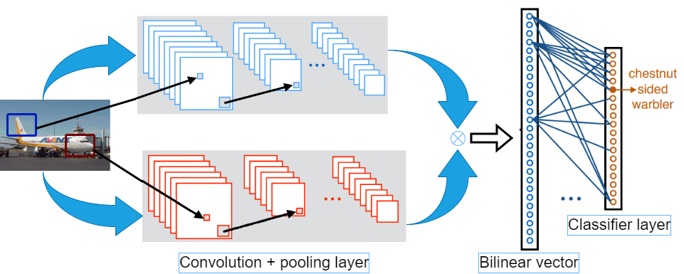

# Fine-Grained Image Classification using Deep Learning
In this very short [PyTorch](http://pytorch.org/) project, we will build a Bilinear CNN Models For Fine-Grained Visual Recognition on [FGVC-Aircraft](https://www.robots.ox.ac.uk/~vgg/data/fgvc-aircraft/) dataset.
## B-CNN network

## Requirements

- Python3
- Other dependencies are in `requirements.txt`

## Generate dataset
  Download the FGVC-Aircraft dataset from [url](https://www.robots.ox.ac.uk/~vgg/data/fgvc-aircraft/), then put and unzip `fgvc-aircraft-2013b.zip` file into the data folder. Run the command below to generate a dataset for the training process.

```
python gen_data.py
```

## Train

  We proposed 5 methods for the classifier training as follows,
```
- python main.py --type_cls softmax
- python main.py --type_cls cvsvm1
- python main.py --type_cls cvsvm2
- python main.py --type_cls cvsvm3
- python main.py --type_cls cvsvm4
```

## Contact

[tuantran23012000]([trananhtuan23012000@gmail.com](https://github.com/tuantran23012000))  
*Please create an issue or contact me through trananhtuan23012000@gmail.com, thanks!*

## Author

TuanTA
